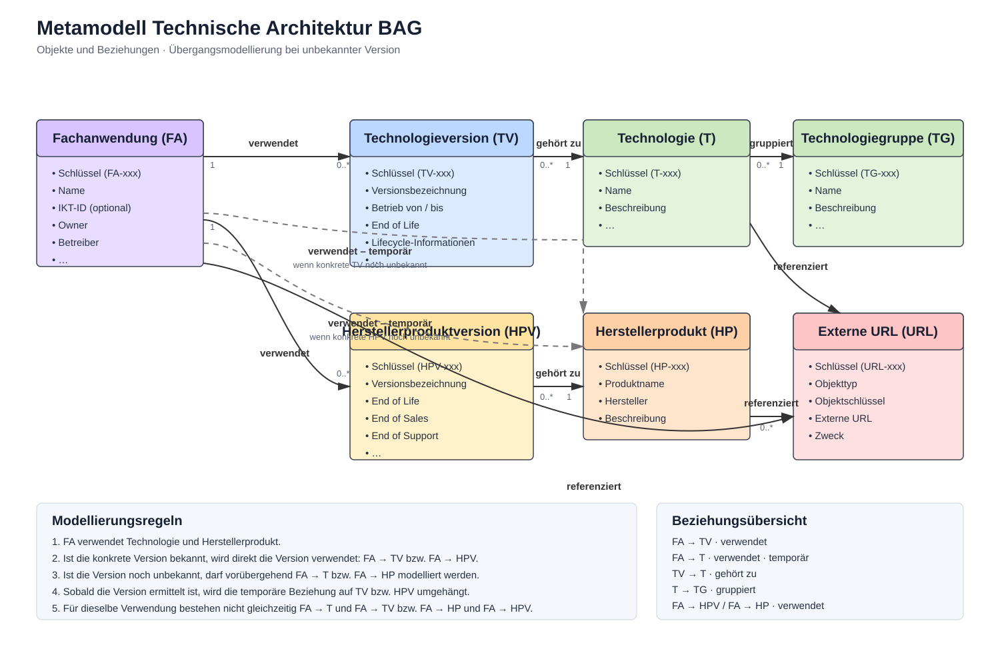

# Objektkürzel und Beziehungen

## Zweck

Diese Dokumentation beschreibt die im technischen Architekturmodell verwendeten Objektkürzel sowie die grundlegenden Beziehungen zwischen den Objekttypen.

## Metamodell – Übersicht



Die Grafik zeigt die Objekte und Beziehungen einschliesslich der temporären Zuordnungen auf Technologie- bzw. Herstellerproduktebene.

## Objektkürzel

| Kürzel | Bezeichnung | Umfang |
|---|---|---|
| **FA** | Fachanwendung | Eine fachlich abgegrenzte Anwendung bzw. ein Anwendungssystem des BAG. |
| **TG** | Technologiegruppe | Eine fachanwendungsunabhängige Gruppierung von Technologien. Sie dient zur Strukturierung und Klassifikation von Technologien. |
| **T** | Technologie | Ein konkreter technischer Baustein bzw. eine Technologie. |
| **TV** | Technologieversion | Eine konkrete Version einer Technologie, einschliesslich Lifecycle-Informationen. |
| **HP** | Herstellerprodukt | Ein konkretes Produkt eines Herstellers, das bei einer Fachanwendung eingesetzt wird bzw. dessen Einsatz dokumentiert oder recherchiert wurde. |
| **HPV** | Herstellerproduktversion | Eine konkrete Version eines Herstellerprodukts, einschliesslich Lifecycle-Informationen. |
| **URL** | Externe URL | Eine externe Referenz zu einem Objekt, z. B. eine offizielle BAG-Seite, Produktseite oder technische Dokumentation. |

## Technologiegruppen

Die Technologiegruppen sind fachanwendungsunabhängig. Gleichartige Gruppen werden nur einmal geführt und können Technologien aus mehreren Fachanwendungen gruppieren. Der Modellstand umfasst acht Technologiegruppen:

| Schlüssel | Technologiegruppe |
|---|---|
| **TG-001** | Integration & Interoperabilität |
| **TG-005** | Web & Applikation |
| **TG-007** | Plattform & Cloud |
| **TG-008** | Datenanalyse & Orchestrierung |
| **TG-009** | Datenmanagement & Storage |
| **TG-011** | Test & Validierung |
| **TG-013** | Datenübertragung |
| **TG-014** | Identity & Access Management |

### Konsolidierungen

Die bisherigen Technologiegruppen wurden auf acht fachanwendungsunabhängige Gruppen konsolidiert:

- TG-001, TG-002, TG-003, TG-004, TG-010, TG-015 und TG-020 → **TG-001 Integration & Interoperabilität**
- TG-005, TG-006 und TG-017 → **TG-005 Web & Applikation**
- TG-007, TG-012 und TG-021 → **TG-007 Plattform & Cloud**
- TG-008 → **TG-008 Datenanalyse & Orchestrierung**
- TG-009, TG-016 und TG-019 → **TG-009 Datenmanagement & Storage**
- TG-011 → **TG-011 Test & Validierung**
- TG-013 und TG-023 → **TG-013 Datenübertragung**
- TG-014, TG-018 und TG-022 → **TG-014 Identity & Access Management**

Die bestehenden Schlüssel der als Zielgruppen verwendeten TG bleiben erhalten. Nicht mehr benötigte TG-Dateien wurden aus der Datenbank entfernt.

## Beziehungen

### Fachanwendung und Technologie

Eine Fachanwendung kann einer Technologie direkt zugeordnet werden, wenn die konkrete Technologieversion noch nicht bekannt ist:

```text
FA-xxx ── verwendet ──> T-xxx
```

Sobald die konkrete Technologieversion bekannt ist, wird die Beziehung auf die Technologieversion umgehängt:

```text
FA-xxx ── verwendet ──> TV-xxx
```

Die beiden Beziehungen stellen somit zwei Zustände derselben Zuordnung dar. Für dieselbe Verwendung wird nach Möglichkeit nicht gleichzeitig eine Beziehung von FA zu T und von FA zu TV geführt. Die Beziehung FA → T ist eine temporäre Zuordnung, bis die verwendete Version ermittelt wurde.

### Technologiegruppe, Technologie und Technologieversion

```text
TG-xxx ── gruppiert ──> T-xxx ── gehört zu ──> TV-xxx
```

Damit gilt die Modellierungsregel:

**TG gruppiert T; T gehört zu TV**

Die Technologiegruppe ist kein Zwischenobjekt zwischen Fachanwendung und Technologie. Die Fachanwendung verwendet T bzw. nach Auflösung der Version TV direkt.

### Fachanwendung und Herstellerprodukt

Auch bei Herstellerprodukten kann die Zuordnung zunächst auf Produktebene erfolgen, wenn die konkrete Produktversion noch nicht bekannt ist:

```text
FA-xxx ── verwendet ──> HP-xxx
```

Sobald die konkrete Herstellerproduktversion bekannt ist, wird die Beziehung auf die Herstellerproduktversion umgehängt:

```text
FA-xxx ── verwendet ──> HPV-xxx
```

Auch hier stellen die beiden Beziehungen zwei Zustände derselben Zuordnung dar. Für dieselbe Verwendung wird nach Möglichkeit nicht gleichzeitig eine Beziehung von FA zu HP und von FA zu HPV geführt. Die Beziehung FA → HP ist eine temporäre Zuordnung, bis die verwendete Version ermittelt wurde.

### Herstellerprodukt und Version

```text
HP-xxx ── gehört zu ──> HPV-xxx
```

### Externe URLs

Externe URLs können als Referenzen an den jeweiligen Modellobjekten geführt werden. Eine URL ist dabei kein Bestandteil der fachlichen bzw. technischen Hierarchie, sondern eine externe Referenz auf ein Objekt.

### Dateinamen in GitHub

- `fachanwendungen/FA-xxx.xml`
- `technologiegruppen/TG-xxx.xml`
- `technologien/T-xxx.xml`
- `technologieversionen/TV-xxx.xml`
- `herstellerprodukte/HP-xxx.xml`
- `herstellerproduktversionen/HPV-xxx.xml`
- `externe_urls/URL-xxx.xml`
- `beziehungen/<Von-Schlüssel>__<Zu-Schlüssel>.xml`

Beispiele für direkte Architekturbeziehungen:

- `beziehungen/FA-002__T-xxx.xml` – temporäre Zuordnung, wenn die Version noch unbekannt ist
- `beziehungen/FA-002__TV-xxx.xml` – aufgelöste Zuordnung zu einer konkreten Technologieversion
- `beziehungen/FA-002__HP-xxx.xml` – temporäre Zuordnung, wenn die Produktversion noch unbekannt ist
- `beziehungen/FA-002__HPV-xxx.xml` – aufgelöste Zuordnung zu einer konkreten Herstellerproduktversion
